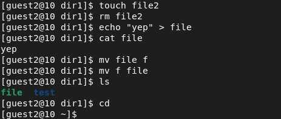

---
# Front matter
title: "Отчет по лабораторной работе №3"
subtitle: "Дискреционное разгарничение прав в Linux. Два пользователя"
author: "Бурдина Ксения Павловна"
group: NFIbd-01-19
institute: RUDN University, Moscow, Russian Federation
date: 2022 Sep 22nd

# Generic otions
lang: ru-RU
toc-title: "Содержание"

# Pdf output format
toc: true # Table of contents
toc_depth: 2
lof: true # List of figures
fontsize: 12pt
linestretch: 1.5
papersize: a4
documentclass: scrreprt
### Fonts
mainfont: PT Serif
romanfont: PT Serif
sansfont: PT Sans
monofont: PT Mono
mainfontoptions: Ligatures=TeX
romanfontoptions: Ligatures=TeX
sansfontoptions: Ligatures=TeX,Scale=MatchLowercase
monofontoptions: Scale=MatchLowercase,Scale=0.9
## Biblatex
biblatex: true
biblio-style: "gost-numeric"
biblatexoptions:
  - parentracker=true
  - backend=biber
  - hyperref=auto
  - language=auto
  - autolang=other*
  - citestyle=gost-numeric
## Misc options
indent: true
header-includes:
  - \linepenalty=10 # the penalty added to the badness of each line within a paragraph (no associated penalty node) Increasing the value makes tex try to have fewer lines in the paragraph.
  - \interlinepenalty=0 # value of the penalty (node) added after each line of a paragraph.
  - \hyphenpenalty=50 # the penalty for line breaking at an automatically inserted hyphen
  - \exhyphenpenalty=50 # the penalty for line breaking at an explicit hyphen
  - \binoppenalty=700 # the penalty for breaking a line at a binary operator
  - \relpenalty=500 # the penalty for breaking a line at a relation
  - \clubpenalty=150 # extra penalty for breaking after first line of a paragraph
  - \widowpenalty=150 # extra penalty for breaking before last line of a paragraph
  - \displaywidowpenalty=50 # extra penalty for breaking before last line before a display math
  - \brokenpenalty=100 # extra penalty for page breaking after a hyphenated line
  - \predisplaypenalty=10000 # penalty for breaking before a display
  - \postdisplaypenalty=0 # penalty for breaking after a display
  - \floatingpenalty = 20000 # penalty for splitting an insertion (can only be split footnote in standard LaTeX)
  - \raggedbottom # or \flushbottom
  - \usepackage{float} # keep figures where there are in the text
  - \floatplacement{figure}{H} # keep figures where there are in the text
---

# Цель работы

Целью данной работы является получение практических навыков работы в консоли с атрибутами файлов для групп пользователей.

# Ход выполнение лабораторной работы

1. В установленной операционной системе создадим учётную запись пользователя guest (используя учётную запись администратора):

2. Зададим пароль для пользователя guest (используя учётную запись администратора):

3. Аналогично создадим второго пользователя guest2:

4. Добавим пользователя guest2 в группу guest:

5. Осуществим вход в систему от двух пользователей на двух разных консолях: guest на первой консоли и guest2 на второй консоли.

6. Для обоих пользователей командой pwd определим директорию, в которой мы находимся:

Видим, что она идентична с приглашениями командной строки и является домашней директорией.

7. Уточним имя нашего пользователя, его группу, а также группы, куда входит пользователь:

С помощью команд groups guest и groups guest2 можем увидеть, что пользователь guest входит в группу guest, а пользователь guest2 помимо своей группы входит также в группу guest. Сравнивая вывод команды groups с выводом команд id -Gn и id -G, видим, что это так и есть. Нам видны группы, в которых состоит каждый из пользователей, а также системные номера данных групп.

8. Сравнивая полученную информацию с содержимым файла /etc/group, видим, что информация о группах пользователей отображается верно:

{width=80%}

9. От имени пользователя guest2 выполним регистрацию пользователя guest2 в группе guest:

10. От имени пользователя guest изменим права директории /home/guest, разрешив все действия для пользователей группы:

11. От имени пользователя guest снимем с директории /home/guest/dir1 все атрибуты:

Проверим правильность снятия атрибутов с директории dir1:

12. Заполним таблицу «Установленные права и разрешённые действия», меняя атрибуты у директории dir1 и файла file1 от имени пользователя guest и делая проверку от пользователя guest2 [1].

Мы рассматриваем вторые три атрибута, которые относятся к группе. Это 64 варианта. 

Проведем действия с атрибутами директории 000 и атрибутами файла с 000 до 070.

Нам требуется для каждого возможного варианта проверить, будет ли выполняться создание и удаление файла, запись в файл, его чтение, смена директории, просмотр файлов в директории, возможно ли будет переименовывать файл, а также изменять его атрибуты.

Установим атрибуты директории dir1 как 000:

Можем понять, что не имея прав ни на директорию, ни на файл мы не можем даже перейти в директорию, поэтому остальные действия точно не будут выполняться. Можем заполнить таблицу минусами при атрибутах директории 000.

Изменим атрибуты директории на 010. У нас появилась возможность на исполнение директории, поэтому теперь мы можем изменять директорию, в которой находимся. Однако при атрибутах файла 000 мы до сих пор не имеем прав на работу с ним.

Изменив атрибуты файла на 010 и получив возможность на исполнение файла, мы по прежнему не будем иметь возможностей для работы группы с файлом.

Изменим атрибуты файла на 020. У нас появилась возможность редактирования файла, поэтому теперь возможно совершить запись в файл, однако прочитать его мы не сможем:

При атрибутах файла 030 будет возможно выполнение аналогичных действий. Нам невозможно ни создание, ни удаление, ни чтение файла, но есть право редактирования:

Изменим атрибуты файла на 040, тем самым получив возможность чтения файла:

При атрибутах файла 050 у нас имеется право на чтение и исполнение, поэтому с предыдущими атрибутами разницы по сути нет.

Далее посмотрим на возможности с атрибутами файла 060. У нас есть возможность чтения и редактирования файла, но по прежнему невозможно создание новых файлом и их удаление:

При атрибутах файла 070 результаты будут аналогичными. При этом можем увидеть, что с данными атрибутами директории у нас все еще нет прав на переименование файлов, просмотр содержимого каталога и изменение атрибутов файла:

По аналогии проведем действия с другими атрибутами директории dir1 (от 020 до 070).

Приведем действия при некоторых из всех возможных атрибутов директории и файла. Например, имея возможности директории на исполнение и редактирование, а файла на исполнение, редактирование и чтение, мы можем производить все действия с файлом, кроме изменения его атрибутов, но при этом не сможем просмотреть содержимое каталога, поскольку не имеем права на чтение:

А вот при максимальных возможностях директории мы можем успешно выполнить все действия:

По итогам заполним общую таблицу. Она выглядит следующим образом:

Проанализировав данную таблицу и сравнив ее с таблицей из прошлой лабораторной работы, можем увидеть, что в целом права на пользователя и на группу сильно не меняются и если давать группе права аналогичные тем, что есть у самого пользователя, то все входящие в группу смогут совершать те же действия, что и сам пользователь.

Заполним также вторую таблицу, где пропишем по результатам заполнения таблицы минимальные права, которые необходимы для совершения каждой из операций:

# Выводы

В ходе работы мы получили практические навыки работы в консоли с атрибутами файлов для групп пользователей, а также проанализировали возможности для группы пользователей при различных атрибутах.

# Список литературы

1. Методические материалы курса
(https://esystem.rudn.ru/pluginfile.php/1651885/mod_resource/content/4/003-lab_discret_2users.pdf)

